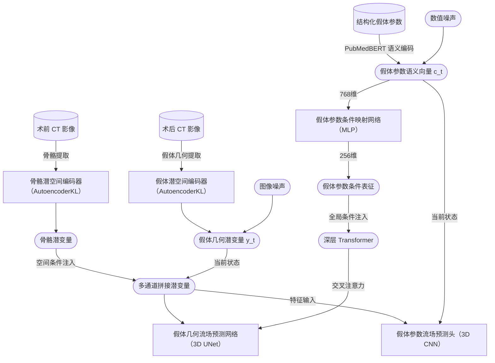
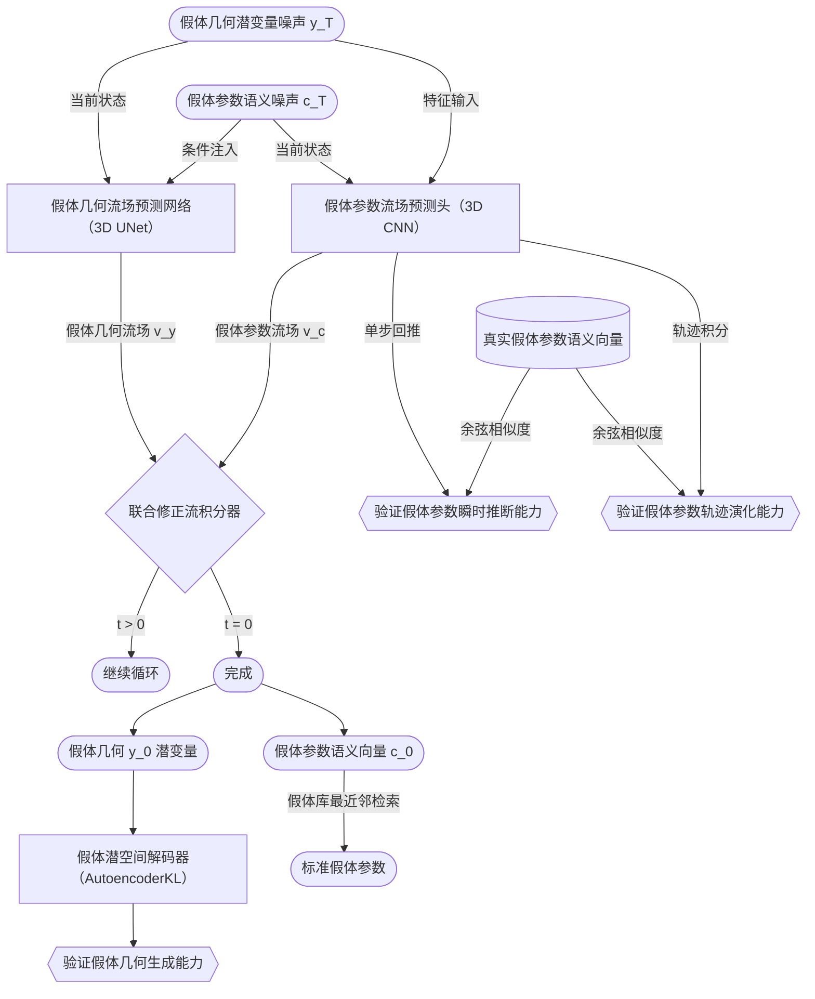
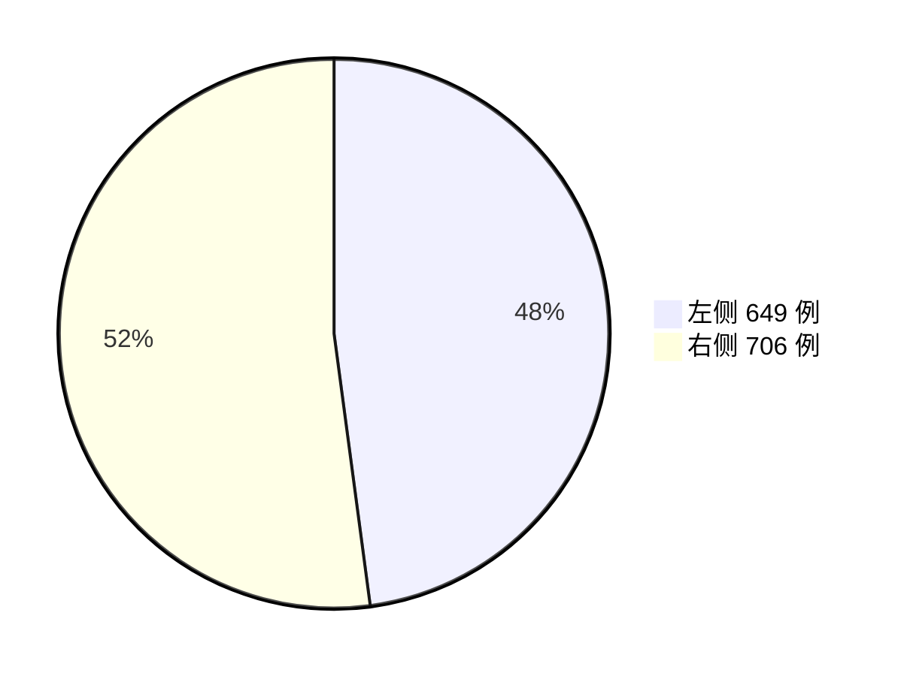
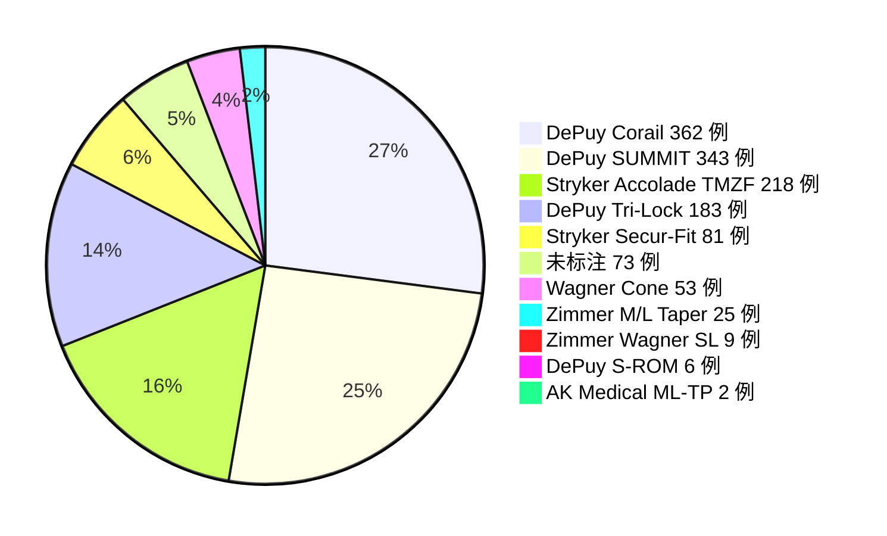

# Nonahip

> 全髋关节置换术（THA）生成式假体预测

## 判别式到生成式的范式转变

传统骨科手术规划长期依赖二维模板测量。即便是数字化规划软件，其底层逻辑仍主要基于解剖参数测量、经验规则推断、假体库匹配，本质上属于规则驱动的半自动化决策模式。现阶段，骨科医疗 AI 多聚焦于解剖标志物识别、医学图像分割、关键参数预测等判别式任务，主要提升了术前测量与图像分析的自动化水平，但尚未充分建立患者个体解剖特征、病变形态与假体适配方案之间的深层映射关系。

长期以来，临床评价体系往往默认 AI 应输出单一最优解，并以其预测结果与实际手术方案的一致性作为核心评价指标。这种确定性思维忽视了真实临床决策中客观存在的多解性。事实上，复杂病例中的多种方案均可能同时满足解剖匹配、力线恢复、假体稳定性及术者偏好等约束条件。所谓单一最优解，往往是特定规则、经验与数据分布共同作用的结果，而判别式模型输出的平均化数值解，本质上只是对复杂决策空间的低维近似。

因此，手术规划更应被视为面向多种可行方案的概率决策问题，其解空间可能呈现离散又局部聚集的分布特征。相较于规则驱动方法和单点预测模型，概率深度学习与生成式采样为探索这一多解空间提供了更合理的技术路径。近期 Google DeepMind 关于 [Vision Banana](https://doi.org/10.48550/arXiv.2604.20329) 的研究提示，高阶生成式模型不仅具备更强的图像语义理解能力，也在检测、分割等判别式任务中展现出超越顶级判别式模型的潜力。

在当前生成式 AI 体系中，自回归模型与扩散模型是两类具有代表性的概率生成范式。其中，去噪扩散概率模型 [DDPM](https://doi.org/10.1038/s41598-023-34341-2) 已被广泛探索用于医学影像补全、异常检测、小样本合成、低剂量重建及跨模态转换等任务，显示出向专病手术规划领域拓展的应用潜力。未来，生成式模型有望推动骨科手术规划从规则匹配与单解预测，进一步迈向端到端建模、多方案生成与概率化智能决策的新范式。

## 骨与假体适配的条件生成

[THA-Net](https://doi.org/10.1016/j.arth.2023.08.063) 是骨科生成式规划领域较早的探索之一，其通过条件扩散模型在术前 X 线图像中生成模拟术后全髋关节置换影像。然而，从技术路径看，该方法遮蔽患侧下肢作为生成区域，以区域外的术前影像作为条件信息，区域内的骨骼、假体及骨与假体界面均由模型自由补全。因此，生成结果能够在视觉上维持区域边界连续性与术后影像合理性，但并不能直接证明重绘区域内患者骨性解剖的真实性，也不能保证假体与患者个体骨骼之间的几何适配关系。换言之，该类方法生成的是视觉可信的骨与假体组合，而非受患者真实骨结构严格约束的假体生成。

为实现骨与假体界面的准确生成，患侧术前骨骼不应作为待补全内容完全遮蔽，而应作为显式条件输入保留，使模型在患者个体骨性形态约束下生成假体。进一步地，相较于直接生成包含复杂纹理、投影重叠、背景噪声的术后 X 线图像，在术前 CT 图像条件下生成三维假体的截断符号距离场（TSDF）更契合手术规划任务的几何本质。

以假体表面作为 TSDF 零等值面，向内外分别延申有限距离（例如 ±5mm）形成连续距离场，超出有限距离的假体外部背景或内部实心区域被截断为常数。这种表达方法能够促使模型学习的注意力集中在假体表面及其邻近区域，而不是分散到远离假体的无关背景或假体内部实心，从而充分学习假体表面形态、局部骨密度分布、骨与假体的接触关系，提供真正适配患者个体解剖的假体生成。

此外，为了进一步增强术前骨骼条件，采用不同比例的分段线性映射归一化，适当放大术前 CT 图像中的质骨到皮质骨区间，适当缩小皮质骨到金属区间，直接丢弃无关的软组织和体外背景。

## 抗伪影的体素级配准

为了训练扩散或流匹配生成模型在患者术前 CT 图像条件下生成假体，需要构建大规模配对的术前术后 CT 数据集。术后 CT 图像包含高密度金属假体的真实几何形态及其植入位姿，可通过高 CT 阈值（例如 2700 HU）分割直接提取假体 TSDF 零等值面，进而构建假体 TSDF 距离场，无需额外引入假体三维网格体。然而，假体周围金属伪影会显著污染邻近骨组织，导致无法从术后图像学习可靠的骨与假体界面。

为了避开金属伪影干扰，应充分利用术前 CT 图像中未受伪影污染的骨性结构。具体而言，通过采样术前术后图像中远离假体金属伪影且未受手术整形的共性骨面，例如股骨小粗隆、股骨髁、髂前上棘、耻骨联合等，作为迭代最近点（ICP）算法的可靠输入，实现高精度的术前术后骨骼刚性配准，从而将术后假体 TSDF 准确映射到术前 CT 图像空间，形成体素级对齐的配对数据集，为后续条件生成模型提供抗伪影且几何一致的训练监督。

## 假体多组件协同生成

由于关节具有活动度，术前术后下肢相对骨盆的空间位姿并不一致，因而关节两侧骨结构及其对应假体组件需分别进行刚性配准。这也意味着，在统一的术前 CT 图像空间生成的两侧假体并不处于装配状态，仍需后处理完成下肢复位与假体组件装配。为了优化这一问题，假体 TSDF 可进一步拆分为两个独立通道，一是包含髋臼杯和股骨柄球头的髋臼侧假体 TSDF 通道，二是包含股骨柄柄体的股骨侧假体 TSDF 通道，两者在股骨柄颈部截断分离，分别跟随骨盆与股骨配准到术前 CT 图像空间。

这种基于互补断面的双通道表示，既保留了假体组件之间的潜在装配关联，又避免了髋臼杯与股骨头球头在影像中难以精确分界所带来的分割误差。通过跨通道全局注意力机制，模型可在假体生成过程中隐式学习下肢复位关系与组件装配约束，从而在端到端生成框架下同时协调关节重建、假体选配、下肢等长、关节活动等多个相互牵制的目标。与追求单一指标最优的判别式预测不同，该过程更接近真实临床决策中对多重约束的折中优化。

## 潜空间自编码器（Latent Autoencoder）

高分辨率三维医学影像体素规模大、显存占用高，直接在原始图像空间训练生成模型计算成本较高。受潜空间扩散模型及 [3D MedDiffusion](https://doi.org/10.1109/TMI.2025.3585372) 等工作的启发，可采用三维自编码器将术前 CT 骨骼图像与假体 TSDF 压缩至连续潜空间，不仅能够降低计算负担，也有助于流匹配或扩散模型在更紧凑的高维流形表征中学习概率分布。

由于 THA 术侧骨盆及下肢区域范围较大，同时需保持 1 mm 或更高空间分辨率以保留关键骨性细节，宜采用分块式三维自编码器进行训练与推理。对于以图像压缩和重建为目标的自编码器，分块与自注意力机制之间存在天然矛盾，应采用纯卷积结构以确保滑动窗口的一致性。

#### 结果评价

| 自编码器 | epoch | L1 | MSE | PSNR (dB) | SSIM | 潜变量缩放因子 | 潜变量全局均值 |
|:---:|---:|---:|---:|---:|---:|---:|---:|
| 骨骼 | 188 | 0.007946 | 0.001102 | 35.85 | 0.9802 | 2.848099 |  0.000233 |
| 假体 |  97 | 0.003313 | 0.000079 | 47.11 | 0.9964 | 7.916767 | −0.002307 |

两类自编码器均达到稳定收敛，并在较低重建误差下取得较高的重建质量，且潜变量接近零均值，缩放因子位于 [0.1, 10] 常见合理区间，能够有效实现高分辨率三维图像的潜空间压缩。其中，假体 TSDF 的缩放因子高于骨骼图像，可能与 TSDF 表征相对稀疏、有效几何信息集中于假体表面附近有关。

术前骨骼自编码器主要用于提取条件潜变量，并不承担最终生成结果的解码输出任务，因此其评价重点在于编码表征的稳定性与空间结构保真度。相比之下，假体 TSDF 自编码器还需将后续生成模型输出的潜变量解码为三维假体几何，因此需进一步评价其潜空间中间区域的可解码性。

| 自编码器 | epoch | rFID | iFID | ΔFID |
|:---:|---:|---:|---:|---:|
| 假体 | 97 | 0.007241 | 0.013177 | < 0.01 |

关于 [iFID](https://doi.org/10.48550/arXiv.2603.05630) 的研究指出，自编码器的重建质量并不必然预测潜在扩散模型的生成质量。即使训练样本的重建质量 rFID 较高，潜空间中由生成模型采样或插值得到的中间潜变量仍可能重建质量 gFID 较低。因此，需进一步评价假体 TSDF 潜空间插值后的解码质量。结果显示，假体自编码器的 rFID 与 iFID 均处于较低水平，且二者差异 ΔFID 较小，提示其潜空间具有良好的连续性、平滑性与可解码性，中间潜变量仍可被解码为结构合理的假体几何，为后续潜空间生成模型提供了可靠的潜变量表征。

## 条件联合修正流匹配（Conditional Joint Rectified Flow Matching）

#### 训练阶段

#### 验证阶段

#### 术前骨骼的空间条件与通道注入

在潜空间生成阶段，采用条件修正流匹配对假体 TSDF 潜变量分布进行建模。对于骨与假体适配任务，术前骨骼并非一般语义条件，而是具有明确体素位置、解剖方位和界面约束的强空间条件。因此，生成模型需要在完整潜空间体积上保持骨性结构与假体几何之间的逐体素对应关系，而不宜削弱或打散其三维空间组织。

[ViT](https://doi.org/10.1007/s10278-025-01481-y) 架构在医学影像任务中表现出较强性能，但其通常需要将三维体数据切分转化为 token 序列，空间关系主要依赖位置编码与注意力机制重建。相较而言，三维 UNet 的卷积归纳偏置更直接有力，其编码解码结构能在规则体素网格中多尺度逐级整合局部几何细节与全局解剖上下文，更有利于维持骨与假体之间连续、稳定的空间方位关系。

[MAISI](https://doi.org/10.1109/WACV61041.2025.00435) 等模型也常使用 ControlNet 通过旁路分支结构注入空间条件，但其本质上是在主干生成网络之外进行特征调控，条件约束相对间接。相比之下，将术前骨骼潜变量与待生成假体潜变量在通道维度直接拼接输入三维 UNet，可在网络最早阶段即建立空间对齐关系，使骨性结构贯穿整个生成过程，形成更直接的逐体素空间约束。

经潜空间自编码器和三维 UNet 多级下采样后，深层特征已高度压缩，因此仅在最深层引入自注意力机制，以在可控显存开销下建模长程依赖。由此，假体生成不只关注局部骨性条件，也能整合骨盆方位、髋臼杯前倾与外展、髋臼覆盖、股骨偏距重建和下肢长度恢复等全局因素。

#### 假体参数的全局条件与联合预测

临床规划不仅要求模型预测假体几何与装配方式，也需要直接给出可记录、可复核的假体型号、规格及组件参数。为此，模型将假体相关参数统一转化为结构化文本描述，并利用医学领域预训练语言模型 [PubMedBERT](https://doi.org/10.1145/3458754) 提取为 768 维连续语义向量。该语义向量经多层感知机 MLP 映射为交叉注意力 token 注入 UNet 的 Transformer 层，使模型具备在指定参数条件下生成特定假体几何结构的能力。

模型架构采用由假体几何生成网络和假体参数预测头组成的解耦训练与联合推理设计。其中，假体参数预测头为轻量级三维卷积回归网络，输入当前假体几何潜变量、术前骨骼条件、当前参数语义状态与时间步，学习参数语义向量在修正流轨迹中的速度场，而不是孤立输出离散分类结果。采样阶段中，假体几何潜变量与参数语义向量在同一修正流框架下耦合演化，使模型能够在生成假体几何的同时反推对应参数。最终输出的连续参数语义向量可通过标准假体库或参数枚举进行最近邻检索，转换为股骨柄型号、规格、髋臼杯外径、股骨头直径、股骨头偏距、内衬偏心等可读参数。

与孤立的判别式参数预测相比，联合流匹配并不以单点分类准确率作为唯一目标。判别式模型可直接学习从术前骨骼到假体参数的映射，但其输出可能与后续生成的假体几何脱节。联合建模将假体几何与参数置于同一采样轨迹中，使二者在生成过程中共同形成，从而更强调几何形态与参数输出的一致性。

#### 多场景多模态联合生成与自监督评估

用 $y$ 表示假体几何，$x$ 表示术前骨骼，$c$ 表示假体参数，$p$ 表示条件概率分布。通过均衡的条件丢弃策略，模型在多种场景下学习条件生成，包括：

| 分布 | 模型能力 | 临床场景 |
|:---|:---|:---|
| $p(y, c)$ | 学习真实假体几何与参数的联合分布 | - |
| $p(y, c \mid c)$ | 按指定型号、规格或组件参数生成假体 | - |
| $p(y, c \mid x)$ | 根据患者术前骨骼生成假体并预测参数 | 患者匹配手术规划 |
| $p(y, c_{pred} \mid x, c_{cond})$ | 试装配指定假体到患者术前骨骼并反推参数 | 假体适配性定量评估 |

其中，$p(y, c \mid x)$ 是最核心的手术规划场景。假体参数 $c$ 作为生成条件时允许不完整输入，例如在指定型号范围内寻找合适规格。作为预测目标时，模型输出完整参数语义向量，并通过标准假体库或参数枚举检索得到最匹配的真实假体规格。

假体试装配场景 $p(y, c_{pred} \mid x, c_{cond})$ 具有独特的自监督校验机制。由于浅层通道拼接的骨骼空间约束 $x$ 通常强于深层交叉注意力注入的参数约束 $c_{cond}$，当指定假体与个体解剖结构存在冲突时，生成网络可能输出带有几何修正的假体以妥协双重条件。参数预测头则依据修正后的几何预测 $c_{pred}$。物理层面的不匹配由此转化为 $c_{pred}$ 与 $c_{cond}$ 的差异，可通过假体参数语义向量之间的余弦距离量化所选假体的不适配程度。

#### 结果评价

真实临床决策本质上是多目标约束下的折中决策。真实术后 CT 中的假体仅是可行解空间中的单一经验样本，因此不建议采用生成结果与真实术后结果之间的相似度作为评价模型生成能力的核心指标。更合理的方式是在数据集群体层面比较生成结果与真实术后结果之间的分布一致性，以评价模型是否学会真实临床决策的条件统计规律。同时，在术前骨骼条件下，有限次随机生成应能覆盖真实术后结果邻域，在指定假体参数条件变化时生成结果应能正确响应。

在真实术后假体几何上，参数预测头可通过单步回推和沿真实几何轨迹的多步积分两种方式评价。前者反映参数语义速度场的瞬时预测准确度，后者反映参数语义向量在连续采样过程中的演化稳定性。二者进入平台期时，通常也提示几何生成网络与参数预测头的联合训练趋于成熟，可作为假体 TSDF 生成训练状态的辅助量化指标。

TODO：补充实际训练结果。

除统计分布评价之外，还可采用更贴近临床医生思维习惯的评价方式，例如分析生成假体的骨皮质穿透率、髓腔有效填充率、接触初始稳定性、骨覆盖率等显式指标，并结合人类专家主观评测，综合评价生成结果的临床可行性。

## 数据集

初始筛选初次全髋关节置换病例 1483 侧髋。经术前术后 CT 配对、假体参数核对、术前术后配准质控及训练样本构建后，排除 128 侧髋，最终纳入 1355 侧髋，来自 1149 名患者。其中，双侧置换 206 例，单侧置换 943 例；左侧置换 649 例，右侧置换 706 例。数据集划分为训练集 1188 例，验证集 84 例，测试集 83 例。

| 术侧 | 训练集 | 验证集 | 测试集 | 合计 |
|:---|---:|---:|---:|---:|
| 左侧 | 572 | 46 | 31 | 649 |
| 右侧 | 616 | 38 | 52 | 706 |
| 合计 | 1188 | 84 | 83 | 1355 |

股骨柄品牌型号分布如下。由于股骨柄型号是临床规划中最受关注的离散假体参数之一，验证集和测试集按股骨柄型号进行分层均衡留出，主要型号各保留 10 例，低频型号按实际可用病例数纳入，以保证模型评价对不同假体类型具有充分覆盖。

| 股骨柄型号 | 训练集 | 验证集 | 测试集 | 合计 |
|:---|---:|---:|---:|---:|
| DePuy Corail | 342 | 10 | 10 | 362 |
| DePuy SUMMIT | 323 | 10 | 10 | 343 |
| Stryker Accolade TMZF | 198 | 10 | 10 | 218 |
| DePuy Tri-Lock | 163 | 10 | 10 | 183 |
| Stryker Secur-Fit | 61 | 10 | 10 | 81 |
| 未标注 | 53 | 10 | 10 | 73 |
| Wagner Cone | 33 | 10 | 10 | 53 |
| Zimmer M/L Taper | 9 | 8 | 8 | 25 |
| Zimmer Wagner SL | 3 | 3 | 3 | 9 |
| DePuy S-ROM | 2 | 2 | 2 | 6 |
| AK Medical ML-TP | 1 | 1 | 0 | 2 |

主要假体组件参数分布显示，髋臼杯外径主要集中在 48 到 54 mm，股骨头直径主要为 32 mm 与 36 mm，内衬材料以陶瓷和聚乙烯为主。

| 参数 | 取值 | 数量 | 分布 |
|:---|:---:|---:|:---|
| 髋臼杯外径 | 40 mm | 1 | █ |
|  | 42 mm | 3 | █ |
|  | 44 mm | 34 | ██ |
|  | 46 mm | 111 | ███████ |
|  | 48 mm | 306 | ████████████████████ |
|  | 50 mm | 293 | ███████████████████ |
|  | 52 mm | 263 | █████████████████ |
|  | 54 mm | 202 | █████████████ |
|  | 56 mm | 109 | ███████ |
|  | 58 mm | 20 | █ |
|  | 60 mm | 11 | █ |
|  | 62 mm | 2 | █ |
| 股骨头直径 | 22 mm | 10 | █ |
|  | 28 mm | 160 | █████ |
|  | 32 mm | 611 | ████████████████████ |
|  | 36 mm | 572 | ███████████████████ |
|  | 40 mm | 2 | █ |
| 股骨头偏距 | -5 mm | 63 | ███ |
|  | -4 mm | 67 | ███ |
|  | -3.5 mm | 57 | ███ |
|  | -2.7 mm | 3 | █ |
|  | -2.5 mm | 34 | ██ |
|  | -2 mm | 7 | █ |
|  | 0 mm | 141 | ███████ |
|  | +1.5 mm | 376 | ███████████████████ |
|  | +3.5 mm | 4 | █ |
|  | +4 mm | 5 | █ |
|  | +5 mm | 399 | ████████████████████ |
|  | +8.5 mm | 134 | ███████ |
|  | 未标注 | 65 | ███ |
| 内衬偏心 | 0 mm | 1091 | ████████████████████ |
|  | +4 mm | 186 | ███ |
|  | 未标注 | 78 | █ |
| 内衬材料 | 陶瓷 | 777 | ████████████████████ |
|  | 聚乙烯 | 578 | ███████████████ |

由于术前和术后 CT 扫描范围可能不完全一致，最终训练区域以术前和术后配准后的空间交集为准。所有图像统一重采样至 1 mm 等体素空间，并将尺寸补齐到 32 的整数倍，以适配自编码器和生成模型的多级下采样结构。根据训练区域尺寸统计，自编码器训练时的感受野和滑动窗口尺寸设为 128 × 128 × 128。

| 最小尺寸 | 中位尺寸 | 最大尺寸 |
|:---:|:---:|:---:|
| 128 × 128 × 192 | 160 × 160 × 512 | 256 × 352 × 640 |

## 数据处理管线

#### CT 归档与术前术后配对

原始 CT 数据首先由 DICOM 序列转换为三维 NIfTI 体数据。随后生成轴位和冠状位数字重建投影图，用于快速质控、排除派生序列，并由人工依据检查时间、术侧和影像表现判断同一患者同一次手术对应的术前与术后 CT 配对。

骨性区域识别采用 [TotalSegmentator](https://doi.org/10.1148/ryai.230024) 进行粗略分割，提取髋骨和股骨等解剖区域作为后续 ROI 定位依据。该步骤并不依赖分割边界作为最终监督，而是用于在大范围 CT 中自动定位术侧髋骨、股骨及其邻近假体区域，从而降低人工裁剪成本，并为后续基于真实 CT 灰度和表面重建的配准流程提供稳定初始范围。

#### 假体参数结构化

假体参数录入以病史记录中收费单上的货号为主要依据，并结合假体厂商公开产品手册中明确给出的规格参数进行结构化整理。股骨柄型号与规格、髋臼杯外径、股骨头直径、股骨头偏距、内衬材料和内衬偏心距被保存为病例级参数标签。随后根据术后金属影像对可实测参数进行核对和纠正，当病史记录与影像实测不一致时，以影像实测值作为全局条件，因为全局条件的本质是对当前术后图像中假体状态的准确描述。对于收费记录和影像实测均无法可靠确认的字段，则保留为未标注；少量原始记录缺失导致的未标注字段，在训练中自然对应部分参数条件或无参数条件情形，并融入随机条件丢弃策略。

#### 术前术后骨性配准

为获得术前骨骼与术后假体之间的体素级对应关系，配准阶段以术前骨表面作为稳定参考，将术后骨结构及其对应假体刚性映射回术前 CT 坐标系。由于术前术后下肢相对骨盆姿态可能发生变化，髋臼侧与股骨侧分别估计独立变换矩阵，以保留两侧骨结构与假体组件之间的局部几何关系。

术侧髋骨配准相对稳定。髋臼杯金属伪影通常局限于髋臼周围，而髂骨、坐骨和耻骨构成范围较大且方位特异性强的单一骨性刚体，不包含骶骨。即使术前术后 CT 扫描范围不完全一致，只要以坐骨底部等稳定下缘结构提供合理的初始 Z 轴对齐，ICP 通常可在大范围髋骨表面约束下收敛到准确配准结果。

术侧股骨配准更具挑战。股骨柄金属伪影可能污染近端大部分区域，股骨干长轴又具有一定旋转非特异性，因此不能简单依赖全股骨表面均匀采样。配准时优先利用股骨小粗隆及其邻近骨干等术前术后共有、远离金属伪影且具有旋转特异性的骨面。由于股骨扫描范围常存在明显长短差异，且股骨颈截骨会造成近端形态不一致，采样时需根据近端裁剪距离和纵向范围排除受手术改变的区域，再通过不允许缩放和镜像的 ICP 完成精细刚性配准。

局部 ROI 中估计得到的 ICP 变换进一步结合术前、术后 ROI 偏移量，还原为原始 CT 坐标系下的全局变换。随后依据髋臼侧和股骨侧独立配准矩阵，将术后 CT、金属分割和假体几何分别重采样到术前空间。训练区域取术前扫描范围与配准后术后扫描范围的共同有效区域，并额外覆盖髋臼杯、股骨头及假体邻近 TSDF 计算范围，从而同时保证骨骼条件完整、假体监督不被裁剪，并避免超出任一原始扫描范围。

配准质量不单纯依赖 ICP 的均方根距离评价，因为低残差并不必然代表关键解剖区域对齐正确。每例样本均生成正位和侧位叠加预览图，用于人工复核术前参考骨面、术后参与配准骨面、采样点及金属假体剪影之间的空间关系。数据纳入遵循配准有效性原则。对于假体与髓腔匹配最关键的区域，即股骨小粗隆至股骨柄末端范围，术前术后骨性结构应保持一致；若该区域存在骨折、粗隆下截骨或其他有意改变骨干形态的手术操作，则应予以排除。部分病例除髋臼杯和股骨柄外可见内固定钉、钢圈或钢板等既往内固定材料，只要其不破坏关键配准区域的一致性，仍可纳入数据集。

#### 假体几何提取

最终训练样本以术前 CT 作为骨骼条件通道，以配准后术后 CT 中提取的假体 TSDF 作为生成通道的几何监督。术后 CT 依据高阈值确定金属区域，再经过形态学闭合和孔洞填充，修复光子饥饿效应导致球头内部暗化形成的伪空腔。随后采用 CUDA 加速的 [DiffDMC](https://github.com/SarahWeiii/diso) 从金属体素重建封闭水密的假体表面网格体，并以该实体表面作为零等值面，分别计算髋臼侧和股骨侧假体 TSDF 连续距离场，形成双通道几何监督。

#### 数据自动化处理与质控

[NVIDIA Warp](https://github.com/nvidia/warp) 支持在 Python 环境中编写即时编译（JIT）的 GPU kernel，并可与 NumPy、PyTorch 数据结构互操作，同时提供网格体距离场查询、体数据采样、刚体变换等几何计算原语。借助这些特性，数据处理管线对 ICP 配准中的最近点搜索、金属伪影避让采样、CT 图像重采样、假体 TSDF 距离场计算等逐点或逐体素遍历的关键算法进行并行加速，显著提高了处理效率，使数据处理能够在统一流程中自动化完成。与此同时，管线自动存档关键过程的可视化记录，并最终由人工复核确认，确保形成标注一致、可重复的高质量数据集。
