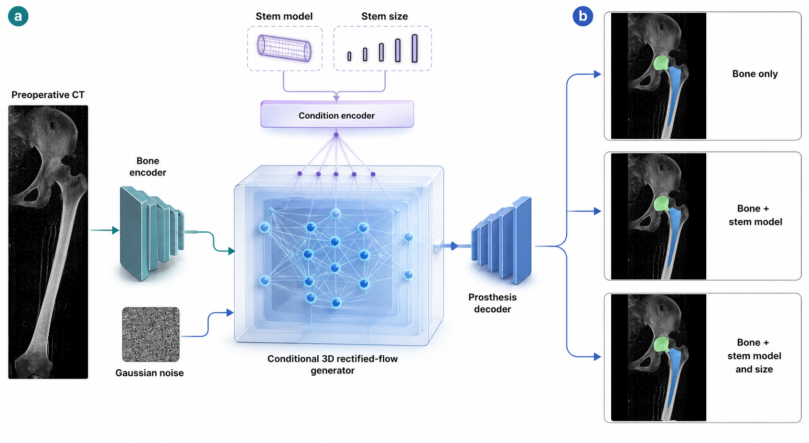
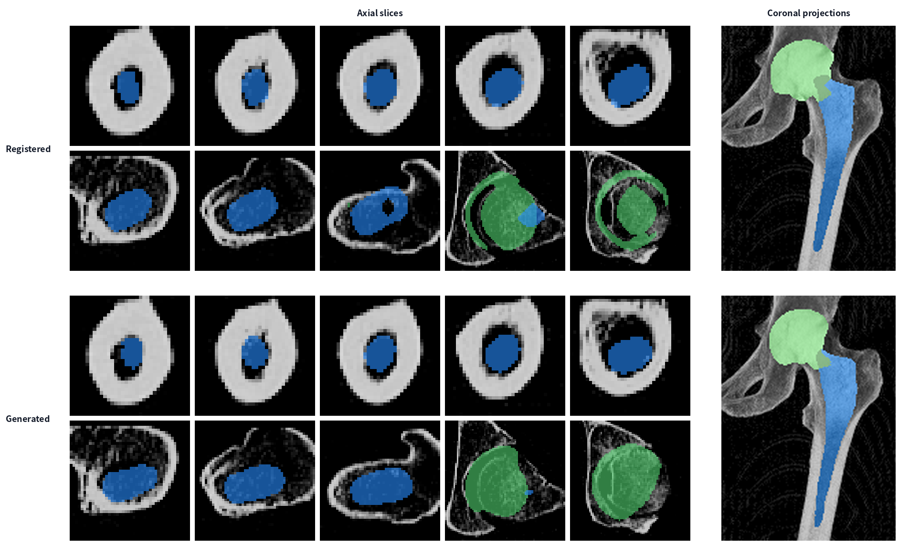
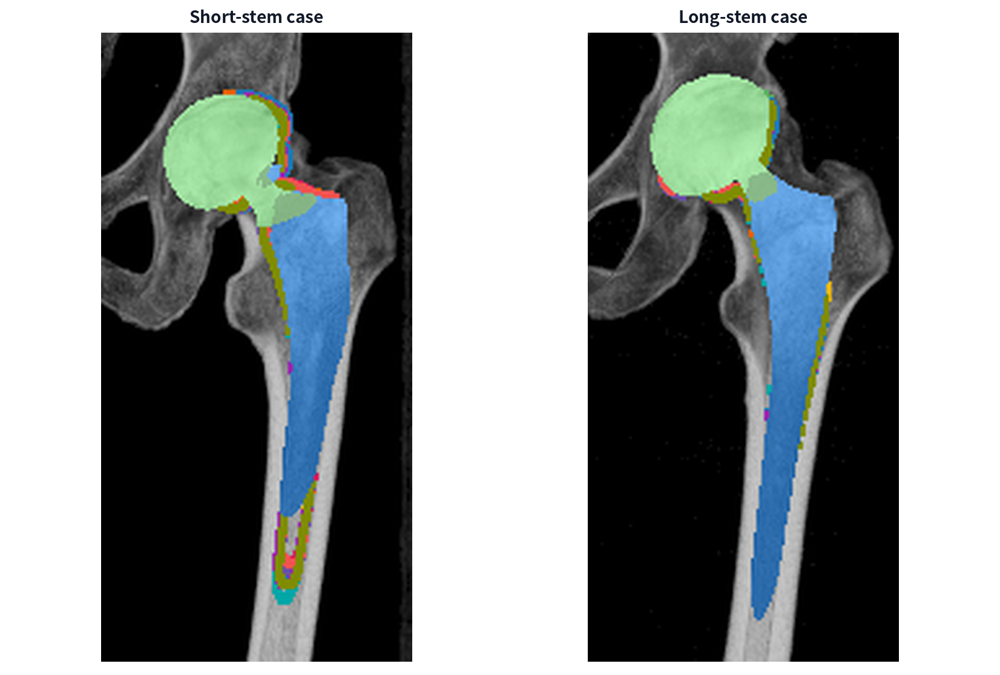

# THA-Flow Generative Model: Prosthesis Geometry Prediction from Preoperative CT

**Yiping Wang**1,\*, **Jie Li**2, **Jingyu Shen**1, **Liao Wang**2,\*

1Changzhou Jinse Medical Information Technology Co., Ltd., Changzhou 213000, Jiangsu, China  
2Shanghai Key Laboratory of Orthopaedic Implants, Department of Orthopaedic Surgery, Shanghai Ninth People's Hospital, Shanghai Jiao Tong University School of Medicine, Shanghai, China

## Abstract

Preoperative planning for total hip arthroplasty (THA) is commonly framed as selecting a single prosthesis configuration and placement for a patient's osseous anatomy. In practice, however, the same anatomy may admit several clinically reasonable solutions, making planning inherently a one-to-many problem that is better represented by a conditional probability distribution. We present THA-Flow, a conditional flow-matching model that generates three-dimensional prosthesis geometry directly from preoperative CT. Separate AutoencoderKL models compress preoperative bone anatomy and prosthesis geometry, while a three-dimensional UNet learns a rectified flow from Gaussian noise to the prosthesis latent space under spatial bone conditioning and optional structured prosthesis parameters. The retrospective cohort comprised 1,355 hips from 1,149 patients undergoing primary THA. Following rigid registration of postoperative CT to preoperative CT, the actual postoperative prostheses were transformed independently according to the pelvic and femoral registrations and represented as a dual-channel truncated signed distance field. The prosthesis autoencoder achieved a peak signal-to-noise ratio of 47.11 dB and a structural similarity index of 0.9964 on the validation set. Complete acetabular and femoral geometries were generated across seven major stem models representing 93.4% of the cohort. Repeated bone-conditioned sampling preserved component position, alignment, and the principal bone–prosthesis interfaces while allowing limited local geometric variation. To our knowledge, THA-Flow represents the first application of generative AI to three-dimensional surgical planning for THA.

**Keywords:** Total hip arthroplasty; Surgical planning; Patient-matched prosthesis; Flow-matching model

  

  

  

